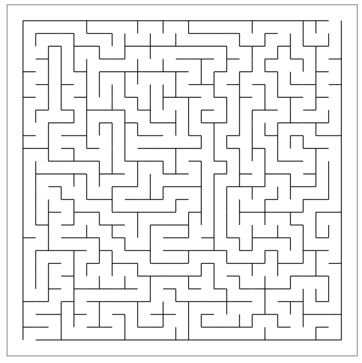

# Rmaze

Rmaze is a package that provides options to generate and plot mazes in R. 

## Installation

To install the Rmaze package, run the following command:

    devtools::install_github("Vessy/Rmaze")
    library("Rmaze")

## Shiny

To run an app showcasing the Rmaze features, run the following command:
  
  Rmaze::runExample()

## Questions or help
To report a bug, problem, or question, please open an issue.

## Additional resources

Want to learn more about maze, see:

[http://www.jamisbuck.org/presentations/rubyconf2011/index.html](http://www.jamisbuck.org/presentations/rubyconf2011/index.html)
[http://weblog.jamisbuck.org/2011/2/7/maze-generation-algorithm-recap](http://weblog.jamisbuck.org/2011/2/7/maze-generation-algorithm-recap)
[http://www.astrolog.org/labyrnth/algrithm.htm](http://www.astrolog.org/labyrnth/algrithm.htm)
[https://en.wikipedia.org/wiki/Maze_generation_algorithm](https://en.wikipedia.org/wiki/Maze_generation_algorithm)
